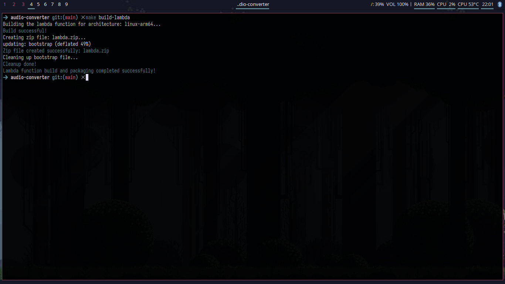
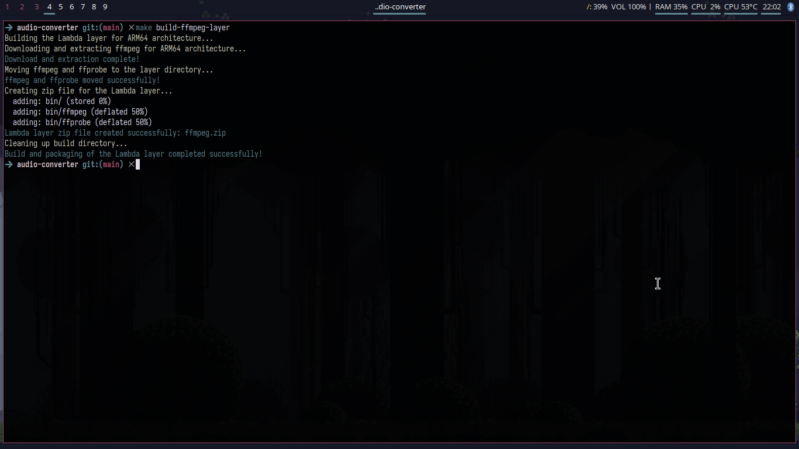
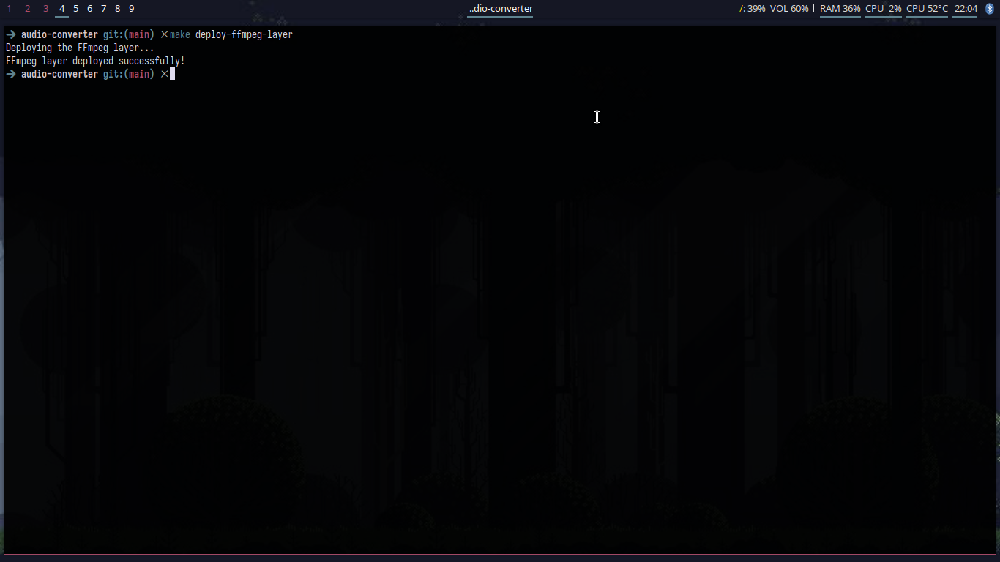
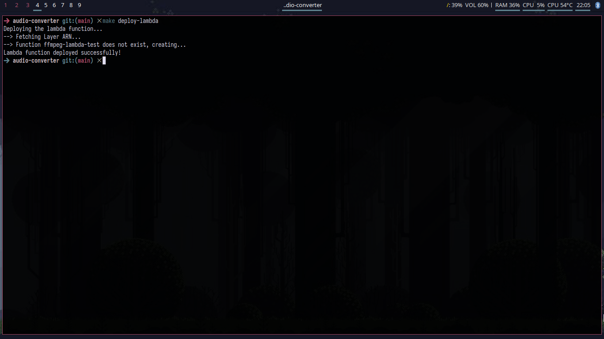

# Scripts Doc
[Versão em Português](scripts_doc_pt.md)   
Scripts are used on this project to automate task execution, such as building the lambda and ffmpeg layer and deploying then to the AWS Lambda service. These scripts are written in shell and are used on makefile to execute the tasks.

## Available Scripts
### **`make help`**: Show the available commands in the Makefile.  
  

### Step-by-Step of `make build-lambda`
1. Build the go binary for linux arm64. 
2. Create a zip file with the binary.  
  

### Step-by-Step of `make build-ffmpeg-layer`
1. Download the [ffmpeg static tar](https://johnvansickle.com/ffmpeg/releases/ffmpeg-release-arm64-static.tar.xz) for arm64.
2. Extract the tar file.
3. Create a zip file with the ffmpeg and ffprobe binaries.  
  

### Step-by-Step of `make deploy-ffmpeg-layer`
Note: The layer zip file must exists.
1. Upload the ffmpeg layer to AWS lambda.  
   

### Step-by-Step of `make deploy-lambda`
1. Get the layer ARN from the AWS Lambda service.
2. If the lambda function already exists, update it with the new zip file and configurations.
3. If the lambda function does not exist, create it with the zip file and configurations.
Pre-requisites: 
- Lambda zip file must exists.
- FFmpeg layer must exists.
- The lambda env variables must be set following the example below:
```json
{
  "Variables": {
    "MONGO_URI": "your_mongo_uri_with_credentials",
    "MONGO_DB": "your_database_name",

    "WORK_DIR": "/tmp/audio_converter",

    "FFMPEG_BIN_PATH": "/opt/bin/ffmpeg",
    "FFPROBE_BIN_PATH": "/opt/bin/ffprobe",

    "AUDIO_CONTENT_TYPE": "audio/m4a",
    "AUDIO_CODEC": "aac",
    "AUDIO_FORMAT": "m4a",

    "CONTENT_SUFFIX": ".m4a",
    "THUMBNAIL_SUFFIX": "thumbnail"
  }
}
```  
  

### **`make sloth`**: Runs the sloth mode to execute all the tasks to build and deploy the lambda function and ffmpeg layer.
Note: Yeah, I'm lazy, so I created this script to run all the tasks in one command. It runs the `make build-lambda`, `make build-ffmpeg-layer`, `make deploy-ffmpeg-layer` and `make deploy-lambda` commands in sequence.
  

## Pre-requisites:
- **AWS CLI**: The AWS CLI must be installed and configured with the credentials to access the AWS Lambda service.
- **tar**: The xz-utils package must be installed to extract the ffmpeg static tar.xz file.
- **zip**: The zip tool must be installed to create the zip files for the lambda function and ffmpeg layer.
- **curl**: The curl tool must be installed to download the ffmpeg static tar file.
- **.env**: The .env file must be created with the environment variables for Makefile work correctly. You set up it following the example below:
```plaintext
## Local environment examples ##
LAMBDA_ROLE=your_role_arn (arn:aws:iam::**:role/**)
```

## Expected Outcomes
- [x] Automate the build and deployment of the lambda function and ffmpeg layer.
- [x] Build for arm64 architecture, which is more cheaper and efficient for AWS Lambda in golang.
- [x] Use the ffmpeg static binaries to avoid the need to compile ffmpeg from source.
- [x] Use the AWS CLI tools.

## Future Improvements
- [ ] Add support for other architectures, such as x86_64.

## Links
- [AWS Lambda doc](https://aws.amazon.com/pt/lambda/)
- [AWS CLI doc](https://aws.amazon.com/cli/)
- [FFmpeg doc](https://ffmpeg.org/ffmpeg.html)
- [FFprobe doc](https://ffmpeg.org/ffprobe.html)
- [Scripts folder](../../scripts)
- [Makefile](../../Makefile)
- [Back to the main doc](../../README.md)
