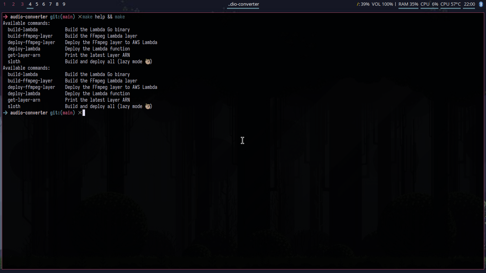
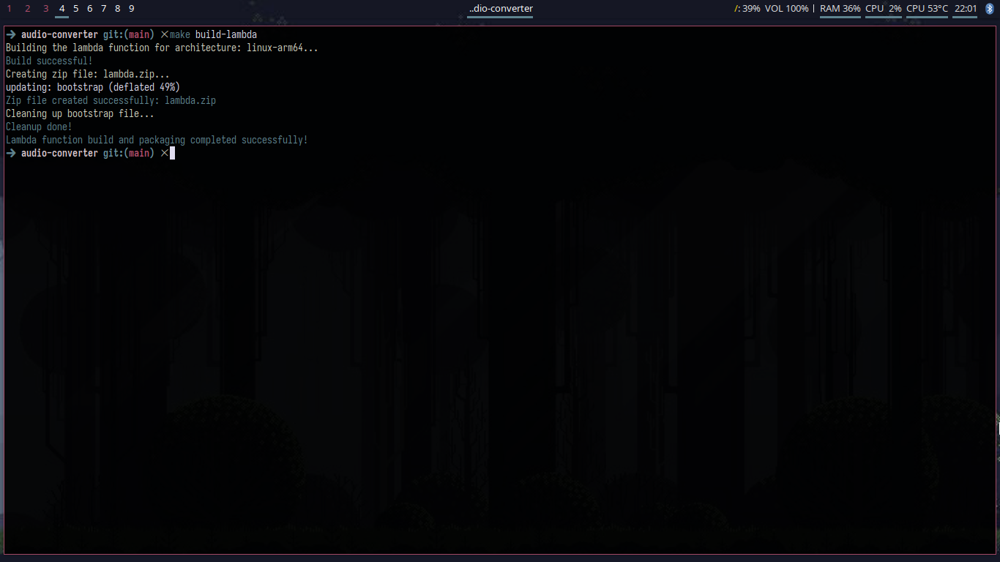
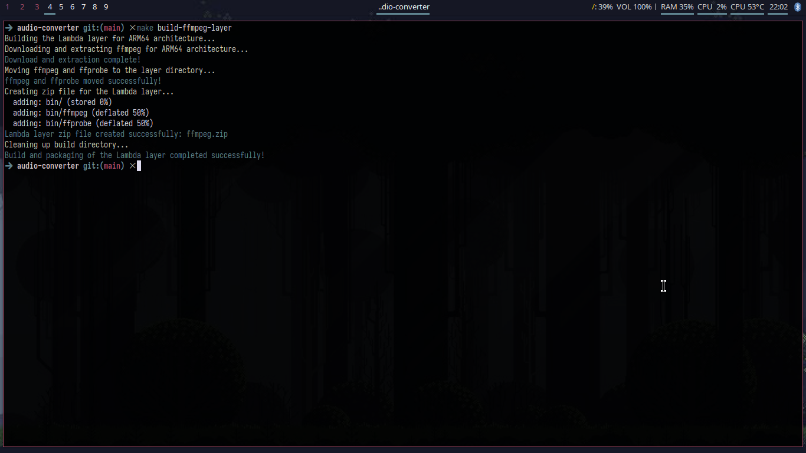
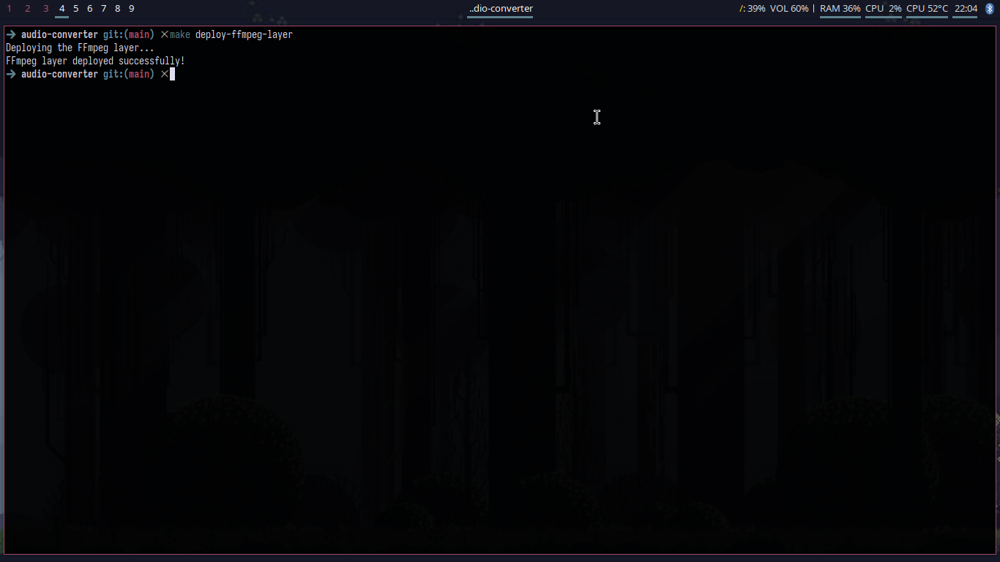
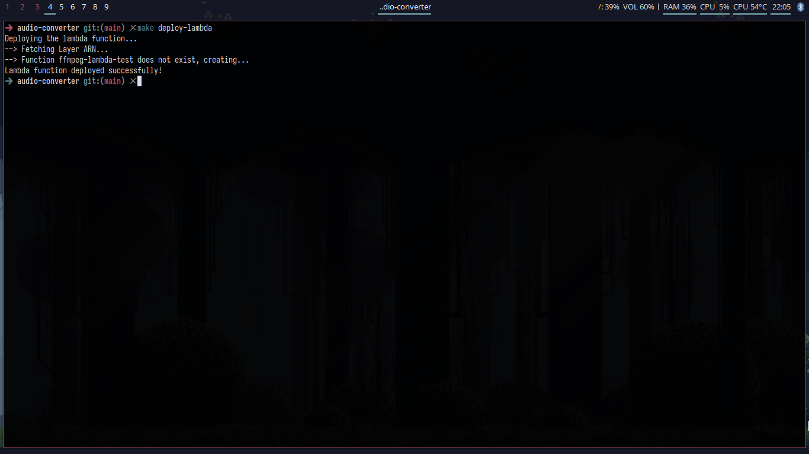
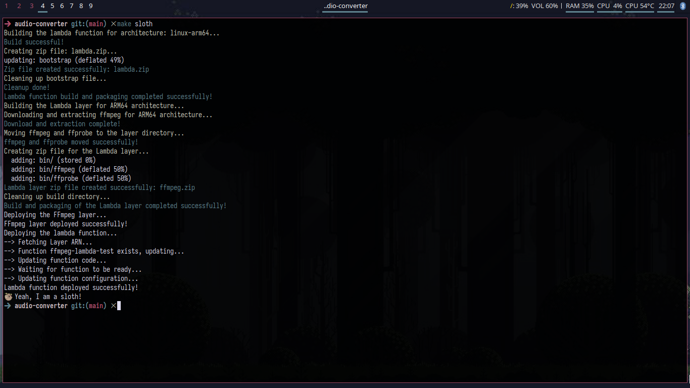

## Scripts Doc
[English Version](scripts_doc_en.md)   
Scripts são usados neste projeto para automatizar a execução de tarefas, como building a função lambda e a camada ffmpeg e deploying para o serviço AWS Lambda. Esses scripts são escritos em shell e são usados no makefile para executar as tarefas. 

## Scripts Disponíveis
### **`make help`**: Mostra os comandos disponíveis no Makefile.  
  

### Passo a Passo de `make build-lambda`
1. Build o binário go para linux arm64.
2. Cria um arquivo zip com o binário.  
  

### Passo a Passo de `make build-ffmpeg-layer`
1. Download do [ffmpeg static tar](https://johnvansickle.com/ffmpeg/releases/ffmpeg-release-arm64-static.tar.xz) para arm64.
2. Extrai o arquivo tar.
3. Cria um arquivo zip com os binários ffmpeg e ffprobe.
    

### Passo a Passo de `make deploy-ffmpeg-layer`
Nota: O arquivo zip do layer deve existir. 
1. Faz o upload do layer ffmpeg para o AWS lambda.  
   

### Passo a Passo de `make deploy-lambda`
1. Obtém o ARN do layer do serviço AWS Lambda.
2. Se a função já existir, atualiza-a com o novo arquivo zip e configurações.
3. Se a função não existir, cria-a com o arquivo zip e configurações.
Pré-requisitos:
- O arquivo zip da função lambda deve existir.
- O layer FFmpeg deve existir.
- As variáveis de ambiente da função lambda devem ser definidas seguindo o exemplo abaixo:
```json
{
  "Variables": {
    "MONGO_URI": "your_mongo_uri_with_credentials",
    "MONGO_DB": "your_database_name",

    "WORK_DIR": "/tmp/audio_converter",

    "FFMPEG_BIN_PATH": "/opt/bin/ffmpeg",
    "FFPROBE_BIN_PATH": "/opt/bin/ffprobe",

    "AUDIO_CONTENT_TYPE": "audio/m4a",
    "AUDIO_CODEC": "aac",
    "AUDIO_FORMAT": "m4a",

    "CONTENT_SUFFIX": ".m4a",
    "THUMBNAIL_SUFFIX": "thumbnail"
  }
}
```  
  

### **`make sloth`**: Executa o modo sloth para executar todas as tarefas de build e deploy da função lambda e do layer ffmpeg.
Nota: Sim, eu sou preguiçoso, então criei esse script para executar todas as tarefas em um comando só. Ele executa os comandos `make build-lambda`, `make build-ffmpeg-layer`, `make deploy-ffmpeg-layer` e `make deploy-lambda` em sequência.  
   

## Pré-requisitos:
- **AWS CLI**: O AWS CLI deve estar instalado e configurado com as credenciais para acessar o serviço AWS Lambda.
- **tar**: O pacote xz-utils deve estar instalado para extrair o arquivo ffmpeg static tar.xz.
- **zip**: A ferramenta zip deve estar instalada para criar os arquivos zip da função lambda e do layer ffmpeg.
- **curl**: A ferramenta curl deve estar instalada para baixar o arquivo ffmpeg static tar.
- **.env**: O arquivo .env deve ser criado com as variáveis de ambiente para o Makefile funcionar corretamente. Você pode configurá-lo seguindo o exemplo abaixo:
```plaintext
## Exemplos de ambiente local ##
LAMBDA_ROLE=your_role_arn (arn:aws:iam::**:role/**)
```

## Resultados Esperados
- [x] Automatizar o processo de build e deploy da função lambda e do layer ffmpeg.
- [x] Build para arm64, que é a arquitetura mais custo benefício para o AWS Lambda em golang.
- [x] Usar o ffmpeg estático para evitar compilar o ffmpeg do source, o que é mais complexo e demorado.
- [x] Usar o AWS CLI tools.

## Melhorias Futuras
- [ ] Adicionar suporte a outras arquiteturas de sistema operacional, como x86_64.

## Links
- [AWS Lambda doc](https://aws.amazon.com/pt/lambda/)
- [AWS CLI doc](https://aws.amazon.com/cli/)
- [FFmpeg doc](https://ffmpeg.org/ffmpeg.html)
- [FFprobe doc](https://ffmpeg.org/ffprobe.html)
- [Scripts pasta](../../scripts)
- [Makefile](../../Makefile)
- [Voltar para a documentação principal](../README_pt.md)
